# IFS — Iterated Function System Explorer

An interactive tool for exploring **Iterated Function Systems (IFS)**, a class of fractals discovered by mathematician Michael Barnsley. This project began at the **Yale Fractal Workshop** (before 2004) and was maintained and extended over more than two decades as a classroom teaching tool.

---

## 📄 [IFS Tutorial (PDF)](ifstutorial.pdf)

The 12-page classroom tutorial used to teach students how to use the application — written by the developer's father for his college mathematics courses. Start here if you want to understand how IFS works and how to create your own fractals.

---

## Screenshots

**IFS 5 — VB6 desktop application**
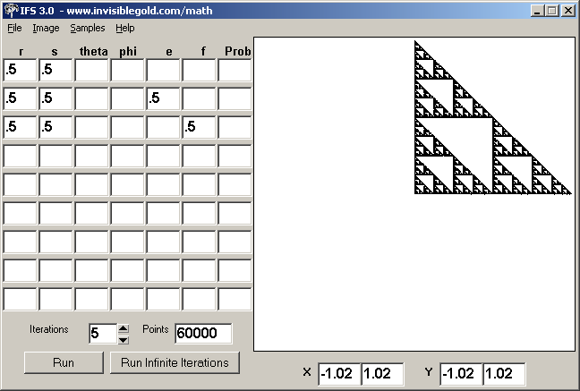

**IFS Web — browser version running in the Invisible Gold CMS, with the file browser open**
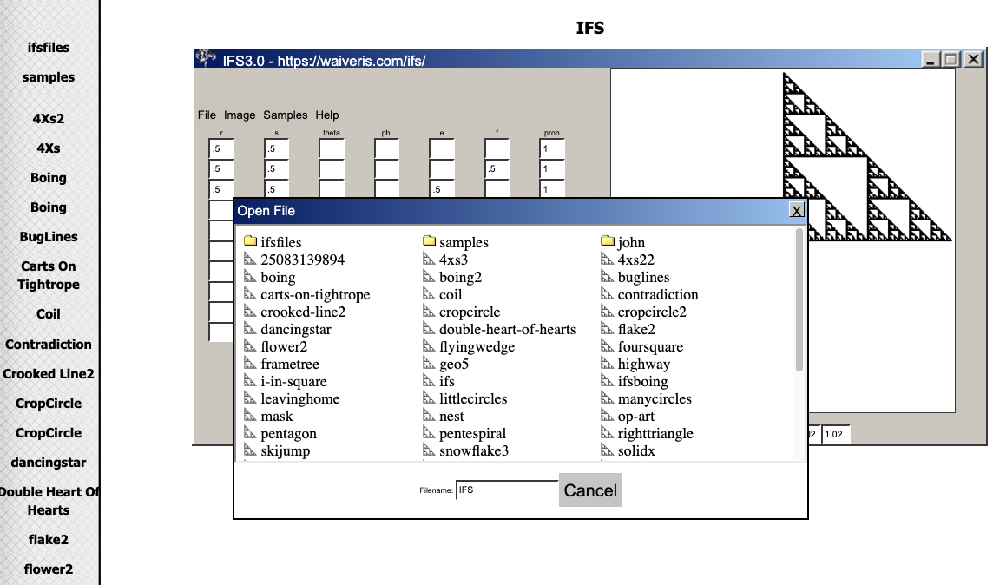

---

## The Story

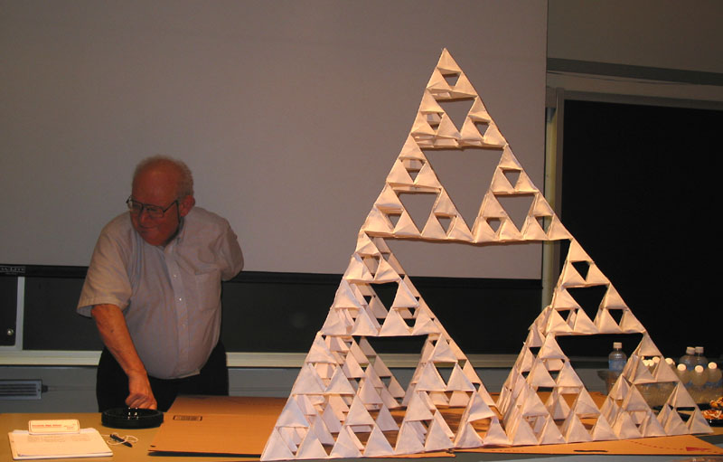
*Mandelbrot with a physical Sierpinski triangle at the Yale Fractal Workshop, 2004 — the day this project started*

At the Yale Fractal Workshop in 2004, the original IFS application was shared by **[Michael Frame](https://en.wikipedia.org/wiki/Michael_Frame)**, a mathematician at Yale who spent decades collaborating with Mandelbrot on fractal geometry education and curriculum. At that same workshop, the developer and his father both attended and had the opportunity to meet and eat lunch with **Benoit Mandelbrot**, the mathematician who coined the term "fractal."

For many years afterward, the developer's father — **Charles Waiveris**, a college mathematics professor — built the IFS application into the heart of his teaching. He used it in his **college mathematics courses** and in summer programs like **CAMPY** (for high school students), where it became a recurring highlight of the curriculum. His work with IFS in the classroom was published in the National Council of Teachers of Mathematics journal *Mathematics Teacher*: **["Iterated Function Systems in the Classroom"](https://eric.ed.gov/?id=EJ756698)** (Vol. 100, No. 5, pp. 369–374, January 2007). John maintained and extended the software throughout this period specifically to support his father's classroom work, adding features, fixing problems, and eventually porting the whole application to the web so students no longer needed to install anything.

Each semester, students would generate their own IFS images — a process that often revealed an artistic side in students who didn't think of themselves as artists. The best images were submitted to a panel of professional artists who voted on their favorites. The top-scoring students received **custom screen-printed t-shirts** bearing their own IFS design.

The collaborative classroom experience was made possible by a companion website John built alongside the application, where students could create accounts, upload their `.ifs` files and rendered images, and browse what their classmates had created. This gallery aspect was central to the experience — seeing your work alongside others, and competing in a friendly artistic competition, made the mathematics feel alive.

---

## Student Galleries

Over 13 years of classes and summer programs, students created thousands of IFS images. The galleries below span college math courses, The Gilbert School, and multiple CAMPY summer sessions from 2004 through 2017.

**[Browse all galleries →](https://waiveris.com/ifsgalleries/)**

Each class was given a prompt image to inspire their work. A selection of those prompts:

| | | |
|---|---|---|
|  |  |  |
| 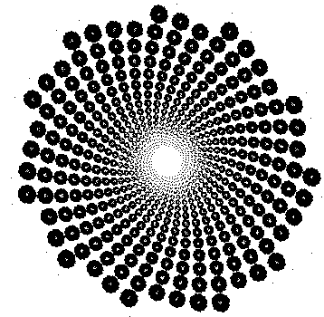 | 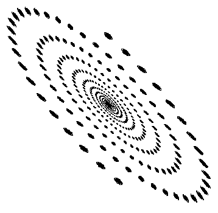 | 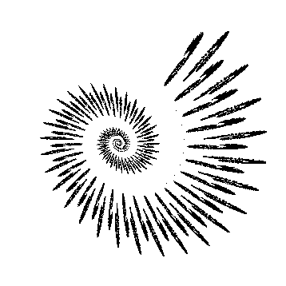 |

---

## What is an Iterated Function System?

An IFS generates a fractal image by repeatedly applying a set of **affine transformations** to a point. Each transformation has the form:

```
X' = X · r·cos(θ)  −  Y · s·sin(φ)  +  e
Y' = X · r·sin(θ)  +  Y · s·cos(φ)  +  f
```

Where:
- **r** — x-scale
- **s** — y-scale
- **θ (theta)** — x-rotation angle (degrees)
- **φ (phi)** — y-rotation angle (degrees)
- **e** — x-translation
- **f** — y-translation

The application supports up to **9 or 10 rows** of transformations, each with a **probability** weight. Each iteration, the algorithm randomly selects a transformation row (weighted by probability), applies it to the current point, and plots the result. Starting from a random point inside the unit square (0,0)→(1,1), after thousands of iterations the plotted points converge to a self-similar fractal attractor.

Setting probability to **0** disables a row, allowing students to see the contribution of each transformation to the final image. Stepping through 1, 2, 3, and then infinite iterations reveals how the pattern emerges from chaos.

---

## Version History

| Version | Platform | Notes |
|---|---|---|
| **IFS 1** | VB6 | Original application from the Yale workshop |
| **IFS 2** | VB6 | Early refinements; binary included in `bin/ifs2/` |
| **IFS 3** | VB6 | Main classroom version; VB6 source in `src/ifs3/` |
| **IFS 4** | VB6 | Transitional version; same codebase in two configurations — `src/ifs4/` (standalone exe build) and `src/ifs4.0/` (web build); did not see wide classroom use |
| **IFS 5** | VB6 | Extended to 9 transformation rows; added phi parameter independently from theta; source in `src/ifs5/` |
| **IFS Web** | JavaScript + CMS | Ported to run in a browser inside the Invisible Gold CMS; rendering in JavaScript on an HTML5 canvas; source in `src/ifsweb/` |

IFS 3 was the workhorse. Distributing the VB6 executable on campus networks was often slow — IT departments needed weeks to approve the Visual Basic runtime — so a web version was developed. The web version launched around the time the developer's father retired, and the classroom program concluded before it was fully tested in a live course.

---

## Features

- **Transformation editor** — up to 9–10 rows of (r, s, θ, φ, e, f, prob)
- **Step-by-step rendering** — run 1, 2, 3, or infinite iterations to watch the fractal emerge
- **Row enable/disable** — set probability to 0 to isolate individual transformations
- **Save / Load `.ifs` files** — store and share transformation sets
- **BMP export** (VB6 versions) — save the rendered image
- **JPG export** (VB6 versions, via `DILib.dll`) — higher-quality image export; the DLL is not freely distributable
- **Animation** — linearly interpolate between two `.ifs` files to generate a sequence of frames; frames were combined into animated GIFs using a shareware tool called Giffy
- **Web gallery** — students upload images and `.ifs` files; classmates browse and vote

---

## Repository Structure

```
IFS/
├── README.md
├── ifstutorial.pdf    # 12-page classroom tutorial
├── ifsfiles/          # 48 sample .ifs files created for classroom use
│
├── galleries/         # 13,500+ student images from 53 classes (2004–2017)
│   └── index.html     # Browsable gallery
│
├── photos/            # Workshop and historical photos
├── screenshots/       # Application screenshots
│
├── bin/
│   ├── ifs2/          # IFS 2.0 compiled executable + 10 sample files
│   └── ifs5/          # IFS 5 compiled executable + 10 sample files
│
└── src/
    ├── ifs3/          # VB6 source — IFS 3 (main classroom version)
    │   ├── IFS2_0.vbp      # Project file
    │   ├── IFS Random.frm  # Main UI form
    │   ├── animation.frm   # Animation dialog
    │   ├── Main.bas        # Entry point
    │   ├── Globals.bas     # Global state
    │   ├── Pixels.bas      # Canvas/pixel rendering
    │   ├── Random.bas      # Random number utilities
    │   ├── Timing.bas      # Timer for progress
    │   ├── crypt.bas       # XOR file encoding (key: "a")
    │   ├── dilib.bas       # JPG export wrapper
    │   ├── dilib.dll       # JPG export DLL (not freely distributable)
    │   └── opendlg.bas     # File open/save dialogs
    │
    ├── ifs4/          # VB6 source — IFS 4 (transitional; standalone build)
    ├── ifs4.0/        # VB6 source — IFS 4 (transitional; web build)
    ├── ifs5/          # VB6 source — IFS 5 (extended version, 9 rows)
    │
    └── ifsweb/        # Web version — Invisible Gold CMS template
        └── Templates/IFS/
            ├── default.xsl     # Main page template (contains JS renderer)
            ├── edit.xsl        # Edit view
            ├── filelist.xsl    # File browser
            └── ifsfiles/       # Sample files bundled with web version
```

---

## The `.ifs` File Format

`.ifs` files are XOR-encoded with the single-character key `"a"` (every byte XOR'd with ASCII 97). This was a light obfuscation with no real security purpose. After decoding, the format is plain text with pipe `|` delimiters and Windows `\r\n` line endings:

```
r|s|theta|e|f|prob[|phi]     ← transformation row 1
r|s|theta|e|f|prob[|phi]     ← transformation row 2
...                            (rows 3–6)
iterations
points
x1|x2|y1|y2                  ← viewport coordinates
r|s|theta|e|f|prob|phi        ← row 7 (IFS 5 extended format)
r|s|theta|e|f|prob|phi        ← row 8
r|s|theta|e|f|prob|phi        ← row 9
```

The `phi` field was added in IFS 5 to allow the y-rotation angle to differ from the x-rotation angle. Older files omit it and default `phi = theta`.

Future versions should save as **plain unencoded text** — the encoding is unnecessary and makes the files opaque in a text editor.

---

## Running the VB6 Applications (Windows Only)

The compiled executables in `bin/` require the **Visual Basic 6 runtime**, which is available from Microsoft. The executables were compiled for Windows and will not run on macOS or Linux without a compatibility layer (e.g., Wine).

To build from source, open the `.vbp` project files in Visual Basic 6.

---

## The Web Version

The web version lives in `src/ifsweb/` and is designed to run inside the **Invisible Gold CMS**. It renders IFS fractals on an HTML5 `<canvas>` using JavaScript. The interface deliberately mirrors the VB6 application so that existing documentation still applies.

A live version is available at the developer's personal website.

The CMS integration means IFS transformation sets become a **page type** — each `.ifs` file is a page, clickable and automatically rendered in the browser. Students can share and browse each other's work without installing any software.

---

## Future Directions

### Near Term — GitHub Archive
The immediate goal is to preserve and share everything here: the VB6 source across all versions, the sample `.ifs` files, and the web version. This serves as both a portfolio piece and an invitation for others to pick up the project in whatever form they choose.

### Medium Term — Redesigned Web Application
The CMS version will be reworked as a first-class web application that does not require prior knowledge of the VB6 interface. The redesign priorities:

- **Teach, don't assume** — explain the unit square, transformations, and probabilities right in the browser; step-by-step interactive introduction
- **Feel like a tool** — not a ported Windows app; modern UI but with the tactile quality of a creative instrument
- **Classroom-ready** — a teacher can set up a class, students create accounts, gallery and voting built in

### Long Term — Standalone HTML File
A fully self-contained `ifs.html` that runs in any browser with no server, no installation, and no CMS — open the file, load a `.ifs`, start exploring. This would include the IFS decoder/encoder, full rendering engine, PNG export, and the sample library embedded in the page.

---

## Credits

- Original IFS application by **[Michael Frame](https://en.wikipedia.org/wiki/Michael_Frame)** ([Yale University](https://fas.yale.edu/news-announcements/faculty-retirement-and-memorial-tributes/faculty-retirement-tributes-2016/michael-frame)) — mathematician, longtime collaborator of Benoit Mandelbrot, and creator of fractal geometry curriculum used in classrooms for decades. Thank you.
- Extended, maintained, and ported to the web by **John Waiveris**
- Classroom curriculum, sample `.ifs` files, and the pedagogical vision behind the project created by **Charles Waiveris** — college mathematics professor, author of **["Iterated Function Systems in the Classroom"](https://eric.ed.gov/?id=EJ756698)** (*Mathematics Teacher*, Vol. 100, No. 5, January 2007), and the reason this software existed at all
- Inspired by the work of **Benoit Mandelbrot** and **Michael Barnsley**
- Deep gratitude to the **Stone Soup Group** and all contributors to **[Fractint](https://en.wikipedia.org/wiki/Fractint)** — the freeware DOS fractal explorer that introduced a generation to this world and remains one of the most remarkable pieces of software ever written

---

## License

The source code in this repository is made available for educational and creative use. The `dilib.dll` file is a third-party component and is not covered by this license.

---

## Background & Inspiration

The thread that led to this project runs back to around **1984** and a program called **Fractint** — a legendary freeware DOS program from the Stone Soup Group that could render hundreds of fractal types on the personal computers of the era. Running it first on an 8088, then a 286, then a 386, the first image that loaded was the Mandelbrot set. One of its most hypnotic features was color-cycling animation: the fractal geometry stayed fixed while the color palette rotated continuously, producing psychedelic, flowing animations from a completely static image.

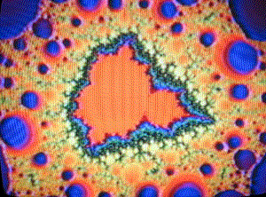 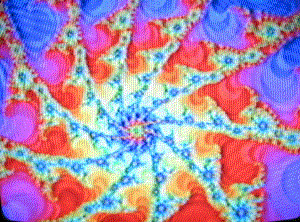 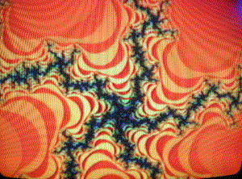 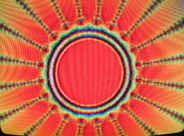
*Fractal animations made with Fractint — color-cycling turned static geometry into something alive*

By **1994**, those techniques had found a commercial application. Fractal animations were licensed for use at the **Rolling Stones Voodoo Lounge tour** and displayed on the jumbotron at Giants Stadium.


*Giants Stadium — fractal animations on the jumbotron during the Voodoo Lounge tour*

A decade later, in **2004**, that same fascination with fractals as a visual and mathematical medium led to the Yale Fractal Workshop — and to this application.

---

### At the Workshop

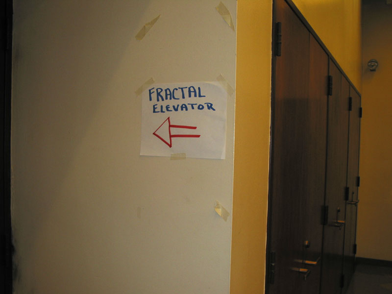
*Navigation at the Yale Fractal Workshop*

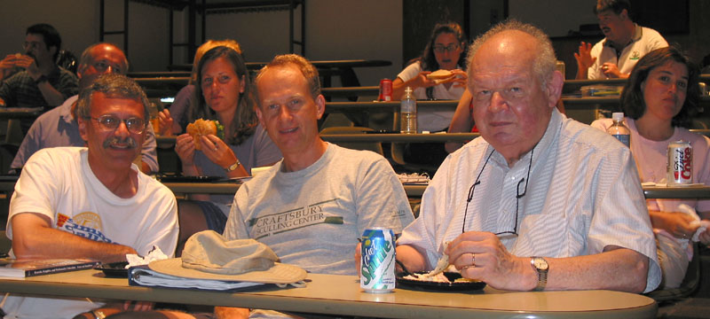
*Lunch in the classroom — Mandelbrot ate with the attendees*


*The developer's father with Mandelbrot*

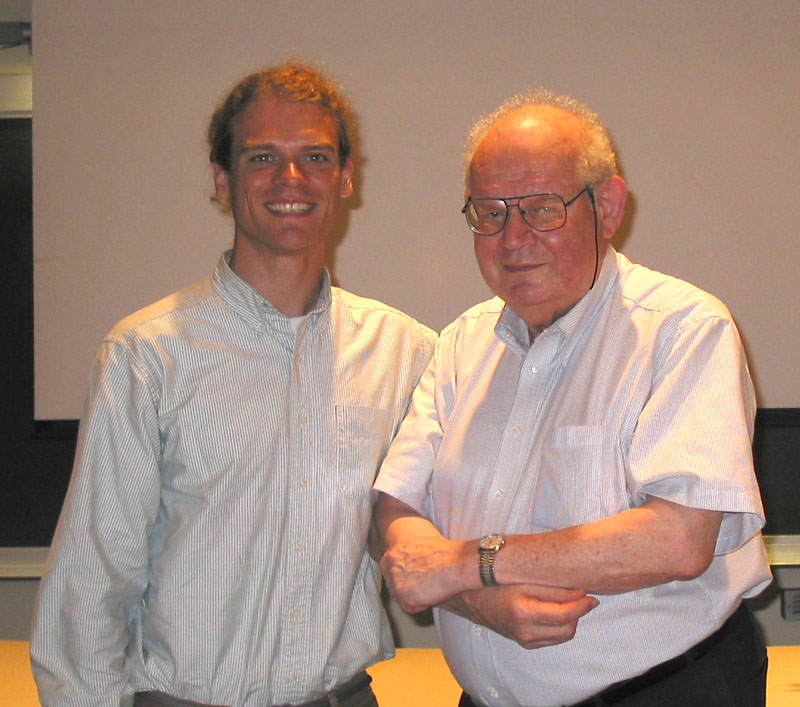
*The developer with Mandelbrot*
